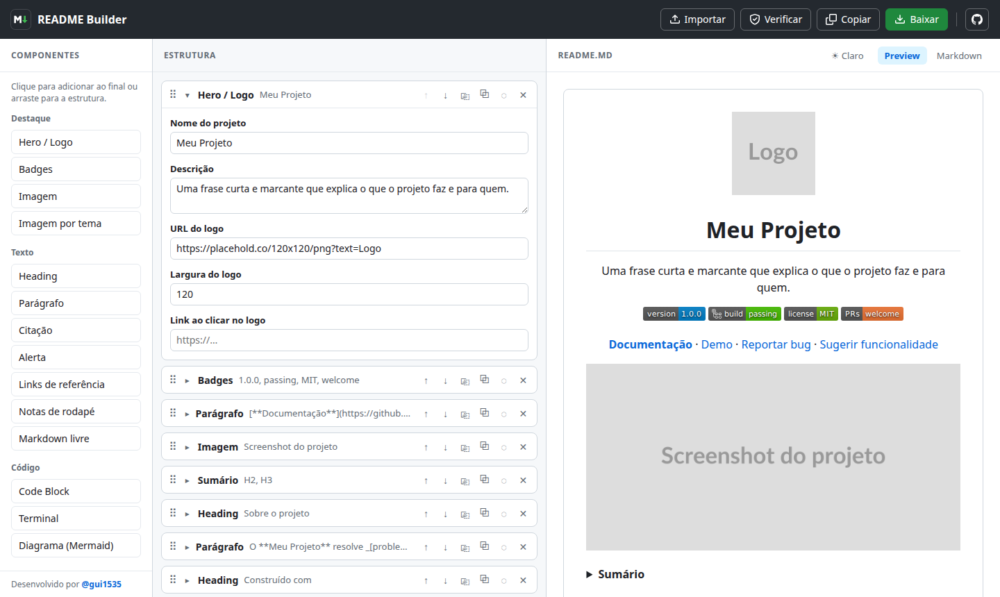
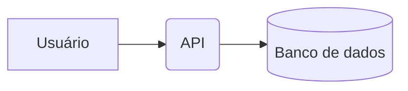

# Markdown aceito

Referência de toda a sintaxe que o GitHub aceita em arquivos `.md` (GitHub Flavored Markdown + HTML permitido) e de como o **README Builder** trata cada uma.

Para cada recurso há três informações:

- **Componente**: qual bloco do builder gera essa sintaxe. Recursos marcados como _inline_ são escritos dentro dos campos de texto (Parágrafo, Lista, Checklist, Tabela, Citação, Alerta, Accordion). Recursos sem componente próprio usam o bloco **Markdown livre**, que insere o conteúdo exatamente como foi escrito.
- **Importação**: em qual bloco o trecho vira ao importar um README existente. O que não tem bloco equivalente é mantido como **Markdown livre**, sem perder conteúdo.
- **Preview**: ✅ renderiza igual ao GitHub · ⚠️ o GitHub renderiza, mas o preview do builder mostra o texto puro.

O preview aplica as mesmas regras de sanitização do GitHub: tags e atributos que o GitHub remove também somem no builder. O botão **Verificar** (e a checagem automática ao baixar) aponta links quebrados, HTML incompatível, imagens sem texto alternativo, notas sem texto e pulos de nível nos títulos.

<details>
<summary><b>Sumário</b></summary>

- [Títulos](#títulos)
- [Parágrafos e quebras de linha](#parágrafos-e-quebras-de-linha)
- [Ênfase e formatação de texto](#ênfase-e-formatação-de-texto)
- [Citações](#citações)
- [Alertas](#alertas)
- [Código](#código)
- [Links](#links)
- [Imagens](#imagens)
- [Listas](#listas)
- [Listas de tarefas](#listas-de-tarefas)
- [Tabelas](#tabelas)
- [Linhas horizontais](#linhas-horizontais)
- [Notas de rodapé](#notas-de-rodapé)
- [Seções expansíveis](#seções-expansíveis)
- [Teclas](#teclas)
- [Emojis](#emojis)
- [Expressões matemáticas](#expressões-matemáticas)
- [Diagramas e mapas](#diagramas-e-mapas)
- [Comentários](#comentários)
- [Escape de caracteres](#escape-de-caracteres)
- [Menções e referências](#menções-e-referências)
- [HTML permitido](#html-permitido)
- [O que o GitHub não aceita](#o-que-o-github-não-aceita)
- [Resumo](#resumo)

</details>

---

## Títulos

Seis níveis, com `#` no início da linha. Um espaço depois do `#` é obrigatório.

```markdown
# Título 1
## Título 2
### Título 3
#### Título 4
##### Título 5
###### Título 6
```

Sintaxe alternativa (Setext), apenas para os níveis 1 e 2:

```markdown
Título 1
========

Título 2
--------
```

Título centralizado ou alinhado à direita exige HTML:

```html
<h1 align="center">Meu Projeto</h1>
```

O GitHub cria uma âncora para cada título: letras minúsculas, espaços viram `-`, pontuação é removida e acentos são mantidos. `## Como começar` vira `#como-começar`. Títulos repetidos recebem `-1`, `-2`…

- **Componente:** Heading (nível e alinhamento). O card mostra a âncora gerada (já com `-1`, `-2` para repetidos); clicar nela copia o link da seção.
- **Importação:** Heading. `<h1 align="…">` com texto simples também vira Heading.
- **Preview:** ✅, com âncoras iguais às do GitHub.

### Sumário

Lista de links para os títulos do próprio documento, normalmente dentro de um `<details>`:

```html
<details>
<summary><b>Sumário</b></summary>

1. [Instalação](#instalação)
   - [Pré-requisitos](#pré-requisitos)
1. [Uso](#uso)

</details>
```

- **Componente:** Sumário (níveis H2/H3/H4, títulos a ignorar, numerado ou com marcadores, recolhível). Atualiza sozinho ao renomear, mover, ocultar ou excluir títulos.
- **Importação:** Sumário quando a lista corresponde exatamente aos títulos do documento; caso contrário, Accordion ou Lista.
- **Preview:** ✅

## Parágrafos e quebras de linha

Parágrafos são separados por uma linha em branco. Uma quebra de linha simples dentro do parágrafo **não** aparece no resultado.

```markdown
Primeiro parágrafo.

Segundo parágrafo.
```

Para forçar uma quebra de linha sem criar outro parágrafo, use uma destas opções:

```markdown
Linha com dois espaços no final··
Linha seguinte

Linha com barra invertida no final\
Linha seguinte

Linha com tag HTML<br>
Linha seguinte
```

> `··` representa dois espaços, que ficam invisíveis no editor.

- **Componente:** Parágrafo (com alinhamento). Aceita Markdown inline.
- **Importação:** Parágrafo.
- **Preview:** ✅

## Ênfase e formatação de texto

| Resultado | Markdown | Alternativa |
| --- | --- | --- |
| **Negrito** | `**texto**` | `__texto__` |
| _Itálico_ | `*texto*` | `_texto_` |
| **_Negrito e itálico_** | `***texto***` | `**_texto_**` |
| ~~Tachado~~ | `~~texto~~` | `~texto~` |
| `Código` | `` `texto` `` | |
| <sub>Subscrito</sub> | `<sub>texto</sub>` | |
| <sup>Sobrescrito</sup> | `<sup>texto</sup>` | |
| <ins>Sublinhado</ins> | `<ins>texto</ins>` | |
| <mark>Marcado</mark> | `<mark>texto</mark>` | |
| <small>Pequeno</small> | `<small>texto</small>` | |

> [!TIP]
> `_` no meio de uma palavra não gera itálico (`nome_de_arquivo` fica como está). Para itálico no meio de uma palavra, use `*`.

- **Componente:** _inline_, em qualquer campo de texto.
- **Importação:** preservado dentro do texto do bloco.
- **Preview:** ✅

## Citações

Cada linha começa com `>`. Citações podem ser aninhadas e conter outros elementos Markdown.

```markdown
> Informação importante sobre o projeto.
>
> > Citação dentro de citação.
```

- **Componente:** Citação.
- **Importação:** Citação.
- **Preview:** ✅

## Alertas

Citações especiais com ícone e cor. O tipo fica sozinho na primeira linha.

```markdown
> [!NOTE]
> Informação útil que o leitor deve notar.

> [!TIP]
> Dica para fazer algo de um jeito melhor.

> [!IMPORTANT]
> Informação essencial para alcançar o objetivo.

> [!WARNING]
> Informação urgente que exige atenção imediata.

> [!CAUTION]
> Aviso sobre riscos ou consequências negativas.
```

> [!NOTE]
> Alertas não podem ser aninhados dentro de outros elementos. Use com moderação: um ou dois por seção.

- **Componente:** Alerta (os 5 tipos).
- **Importação:** Alerta.
- **Preview:** ✅

## Código

### Código inline

```markdown
Rode `npm install` para instalar.
```

Se o código contiver uma crase, use duas crases como delimitador: ``` `` `crase` `` ```.

### Bloco de código

Com três crases ou três tis, seguidos opcionalmente do nome da linguagem para destaque de sintaxe:

````markdown
```javascript
const soma = (a, b) => a + b;
```

~~~python
print("olá")
~~~
````

Linguagens comuns: `bash`, `shell`, `powershell`, `javascript`, `typescript`, `jsx`, `tsx`, `json`, `html`, `css`, `scss`, `python`, `java`, `kotlin`, `swift`, `php`, `ruby`, `go`, `rust`, `c`, `cpp`, `csharp`, `sql`, `yaml`, `toml`, `dockerfile`, `markdown`, `diff`, `text`. A lista completa segue o [Linguist](https://github.com/github-linguist/linguist/blob/main/lib/linguist/languages.yml).

A linguagem `diff` colore linhas adicionadas e removidas:

````markdown
```diff
- const antigo = true;
+ const novo = true;
```
````

Para mostrar três crases dentro de um bloco, use quatro crases como delimitador externo.

Linhas com recuo de 4 espaços também viram bloco de código, mas sem destaque de sintaxe.

- **Componente:** Code Block (com autocomplete de linguagem) e Terminal (comandos, gerado como `bash`). O builder aumenta o delimitador sozinho quando o código contém crases.
- **Importação:** Terminal quando a linguagem é `bash`, `sh`, `shell`, `zsh` ou `console` e não há linhas em branco nem recuadas. Code Block nos demais casos.
- **Preview:** ✅, com cores de sintaxe nos temas claro e escuro (cerca de 30 linguagens, entre elas JavaScript, TypeScript, JSX/TSX, Python, PHP, Java, Kotlin, Swift, Go, Rust, C/C++/C#, Bash, PowerShell, SQL, JSON, YAML, Dockerfile, Markdown e Diff).

## Links

```markdown
[Texto do link](https://github.com)
[Com título ao passar o mouse](https://github.com "GitHub")

Autolink com sinais de menor e maior: <https://github.com>
URL solta também vira link: https://github.com e www.github.com
E-mail vira link: contato@exemplo.com
```

### Links de referência

Úteis quando a mesma URL aparece várias vezes. A definição pode ficar em qualquer lugar do arquivo.

```markdown
Veja a [documentação][docs] e o [guia][docs].

[docs]: https://github.com/usuario/projeto/wiki "Documentação"
```

### Links relativos

Apontam para arquivos do próprio repositório e funcionam em qualquer branch:

```markdown
[Licença](LICENSE)
[Guia de contribuição](docs/CONTRIBUTING.md)
[Raiz do repositório](/README.md)
```

### Links para seções

Usam a âncora gerada pelo título (veja [Títulos](#títulos)):

```markdown
[Ir para Instalação](#instalação)
```

- **Componente:** _inline_, em qualquer campo de texto (botão **Link** ou Ctrl+K na barra de formatação). Imagem, Hero e Badges têm campo próprio de link. As definições de referência ficam no componente **Links de referência** (ID, URL e título); o botão **Link** aceita o ID de uma referência no lugar da URL.
- **Importação:** preservado dentro do texto. Definições de referência seguidas viram um bloco Links de referência.
- **Preview:** ✅. Links para seções rolam o preview; links externos abrem em outra aba.

## Imagens

```markdown



```

Imagem clicável (imagem dentro de um link):

```markdown
[](https://exemplo.com)
```

Tamanho e alinhamento exigem HTML. Os atributos aceitos são `src`, `alt`, `width`, `height`, `title` e `align`:

```html
<p align="center">
  
</p>
```

Imagem diferente para tema claro e escuro:

```html
<picture>
  <source media="(prefers-color-scheme: dark)" srcset="logo-dark.png">
  <source media="(prefers-color-scheme: light)" srcset="logo-light.png">
  
</picture>
```

GIFs animados e SVGs funcionam como imagem comum.

- **Componente:** Imagem (URL, alt, largura, altura, alinhamento, link e legenda), Hero/Logo (logo, nome e descrição centralizados) e **Imagem por tema** (imagem clara, imagem escura, alt, largura, alinhamento e link, gerando `<picture>`).
- **Importação:** Imagem quando o trecho é só uma imagem (em Markdown, em `` ou dentro de `<p align>`/`<div align>`). Hero quando é `<div align="center">` com logo, `<h1>` e `<p>`. Imagem por tema quando é um `<picture>` com fontes clara/escura. Imagens com outros atributos viram Markdown livre.
- **Preview:** ✅. Caminhos relativos funcionam no preview quando o README foi importado do GitHub. O botão de tema do preview (Claro/Escuro) mostra a imagem de cada tema.

### Badges

Badges são imagens geradas pelo [shields.io](https://shields.io):

```markdown

[](https://react.dev)
```

Formato da URL: `https://img.shields.io/badge/<label>-<valor>-<cor>?style=<estilo>&logo=<logo>&logoColor=<cor>`. No texto, `-` vira `--`, `_` vira `__` e espaço vira `_`. Estilos: `flat`, `flat-square`, `plastic`, `for-the-badge`, `social`. Os nomes de logo seguem o [Simple Icons](https://simpleicons.org).

- **Componente:** Badges (label, valor, cor, logo, cor do logo, link, estilo e alinhamento).
- **Importação:** Badges quando o trecho contém apenas badges estáticos (`/badge/`) do mesmo estilo. Badges dinâmicos (stars, versão do npm, status de CI) viram Parágrafo ou Markdown livre, preservados.
- **Preview:** ✅

## Listas

Marcadores com `-`, `*` ou `+`. Numeradas com `1.`. O número inicial define a contagem, e os seguintes podem ser todos `1.`.

```markdown
- Item
- Item
  - Subitem (2 espaços de recuo)
    - Sub-subitem

1. Primeiro
2. Segundo
   1. Subitem (3 espaços de recuo)

3. Começa em 3
4. Continua em 4
```

Um item pode conter parágrafos, código e imagens, desde que o conteúdo acompanhe o recuo do texto do item.

Duas listas do mesmo tipo separadas só por uma linha em branco viram uma lista só. Para mantê-las separadas, coloque um comentário entre elas (o builder faz isso sozinho):

```markdown
- Lista A

<!-- -->

- Lista B
```

- **Componente:** Lista (marcadores ou numerada; um item por linha, 2 espaços para aninhar).
- **Importação:** Lista quando cada item tem uma linha só e todos os níveis são do mesmo tipo. Listas que começam em outro número, com itens de vários parágrafos ou com tipos misturados viram Markdown livre.
- **Preview:** ✅

## Listas de tarefas

```markdown
- [x] Tarefa concluída
- [ ] Tarefa pendente
```

- **Componente:** Checklist.
- **Importação:** Checklist quando todos os itens são tarefas sem subitens.
- **Preview:** ✅

## Tabelas

A linha de separação define o alinhamento de cada coluna. Não é preciso alinhar os `|` visualmente.

```markdown
| Esquerda | Centro | Direita |
| --- | :---: | ---: |
| texto | **negrito** | `código` |
| barra \| escapada | quebra<br>de linha | [link](https://github.com) |
```

Células aceitam Markdown inline. Blocos (listas, código em várias linhas) não são aceitos dentro de células; use `<br>` para quebrar linha. Para barra vertical dentro de uma célula, use `\|`.

- **Componente:** Tabela (editor visual de colunas, linhas e alinhamento). O builder escapa `|` e converte quebras de linha em `<br>`.
- **Importação:** Tabela.
- **Preview:** ✅

## Linhas horizontais

Três ou mais `-`, `*` ou `_` sozinhos na linha:

```markdown
---
***
___
```

> [!WARNING]
> `---` logo abaixo de uma linha de texto transforma o texto em título. Deixe uma linha em branco antes.

- **Componente:** Separador.
- **Importação:** Separador.
- **Preview:** ✅

## Notas de rodapé

```markdown
Uma afirmação com fonte[^1] e outra com nome[^nota].

[^1]: Texto da primeira nota.
[^nota]: Notas podem ter nomes em vez de números.
```

As notas são numeradas na ordem em que aparecem e listadas no final do documento, com link de volta.

- **Componente:** _inline_ para a referência (`[^1]`, botão **Nota** na barra de formatação, que já cria a definição); as definições ficam no componente **Notas de rodapé** (ID e texto).
- **Importação:** a referência fica no texto e as definições viram um bloco Notas de rodapé.
- **Preview:** ✅

## Seções expansíveis

```html
<details>
<summary>Clique para expandir</summary>

Conteúdo em **Markdown**. A linha em branco depois de `</summary>` é obrigatória.

</details>
```

Para começar aberta, use `<details open>`.

- **Componente:** Accordion (título, conteúdo em Markdown e estado inicial).
- **Importação:** Accordion.
- **Preview:** ✅

## Teclas

```html
Pressione <kbd>Ctrl</kbd> + <kbd>C</kbd> para copiar.
```

- **Componente:** _inline_, em qualquer campo de texto.
- **Importação:** preservado dentro do texto.
- **Preview:** ✅

## Emojis

Emojis Unicode funcionam em qualquer lugar: 🚀 ✅ 🚧. O GitHub também converte códigos entre dois-pontos:

```markdown
:rocket: :white_check_mark: :construction: :tada: :bug: :sparkles:
```

Lista completa: [Emoji Cheat Sheet](https://github.com/ikatyang/emoji-cheat-sheet).

- **Componente:** _inline_, em qualquer campo de texto. O botão 😀 da barra de formatação abre um seletor com busca.
- **Importação:** preservado dentro do texto.
- **Preview:** ✅, tanto Unicode quanto códigos como `:rocket:`.

## Expressões matemáticas

Sintaxe LaTeX renderizada com MathJax:

````markdown
Inline: $E = mc^2$ ou $`\sqrt{2}`$ (a segunda evita conflito com outros `$` na linha).

Em bloco:

$$
\sum_{i=1}^{n} i = \frac{n(n+1)}{2}
$$

```math
\int_0^1 x^2\,dx = \frac{1}{3}
```
````

Para um `$` literal no texto, use `\$`.

- **Componente:** _inline_ ou em bloco num Parágrafo; Code Block com linguagem `math`.
- **Importação:** preservado em Parágrafo; blocos ` ```math ` viram Code Block.
- **Preview:** ✅, renderizado com KaTeX.

## Diagramas e mapas

Blocos de código com linguagens especiais viram gráficos no GitHub:

````markdown

````

| Linguagem | Resultado |
| --- | --- |
| `mermaid` | Fluxogramas, sequência, classes, estados, Gantt, pizza, ER, gitgraph, mindmap e outros ([sintaxe](https://mermaid.js.org)) |
| `geojson` | Mapa interativo a partir de GeoJSON |
| `topojson` | Mapa interativo a partir de TopoJSON |
| `stl` | Visualizador 3D de modelos STL (ASCII) |

- **Componente:** **Diagrama (Mermaid)**, com modelos prontos de fluxograma, sequência, classes, estados, ER, Gantt, pizza, gitgraph, mindmap e timeline. Code Block para `geojson`, `topojson` e `stl`.
- **Importação:** Diagrama (Mermaid) para blocos `mermaid`; Code Block para os demais.
- **Preview:** ✅ para Mermaid (nos temas claro e escuro; erros de sintaxe aparecem abaixo do código) · ⚠️ GeoJSON, TopoJSON e STL aparecem como código.

## Comentários

Ficam no arquivo mas não aparecem no resultado. Úteis para instruções a quem edita o README.

```html
<!-- Atualize este badge a cada release -->
```

- **Componente:** Markdown livre.
- **Importação:** Markdown livre.
- **Preview:** ✅ (não aparece).

## Escape de caracteres

Uma barra invertida antes de um caractere especial faz ele aparecer literalmente:

```markdown
\*não é itálico\*   \# não é título   1\. não é lista
```

Caracteres que podem ser escapados: `` \ ` * _ { } [ ] ( ) < > # + - . ! | ~ $ ``.

- **Componente:** _inline_, em qualquer campo de texto.
- **Importação:** preservado dentro do texto.
- **Preview:** ✅

## Menções e referências

Em **issues, pull requests, discussões e comentários**, o GitHub converte automaticamente:

```markdown
@usuario          menção a pessoa
@org/time         menção a time
#123              issue ou pull request
usuario/repo#123  issue de outro repositório
a5c3785           commit (SHA)
```

> [!IMPORTANT]
> Em arquivos `.md` do repositório (como o README), essas referências **não** viram link. Use links completos: `[#123](https://github.com/usuario/repo/issues/123)`.

- **Componente:** _inline_ (como link completo).
- **Importação:** preservado dentro do texto.
- **Preview:** ✅ para links completos.

## HTML permitido

O GitHub aceita um conjunto restrito de tags HTML e remove o resto.

**Tags aceitas:**

| Grupo | Tags |
| --- | --- |
| Estrutura | `div`, `p`, `span`, `br`, `hr` |
| Títulos | `h1` a `h6` |
| Texto | `b`, `strong`, `i`, `em`, `ins`, `del`, `s`, `strike`, `sub`, `sup`, `mark`, `small`, `abbr`, `cite`, `dfn`, `q`, `samp`, `var`, `tt`, `kbd`, `code`, `pre`, `time`, `wbr`, `bdo` |
| Links e mídia | `a`, `img`, `picture`, `source` |
| Listas | `ul`, `ol`, `li`, `dl`, `dt`, `dd` |
| Tabelas | `table`, `thead`, `tbody`, `tfoot`, `tr`, `th`, `td`, `caption` |
| Outros | `blockquote`, `details`, `summary`, `figure`, `figcaption`, `ruby`, `rt`, `rp` |

**Atributos mais usados:** `align` (`left`, `center`, `right`), `href`, `src`, `srcset`, `media`, `alt`, `title`, `width`, `height`, `open` (em `details`), `colspan`, `rowspan`, `name`, `id`, `lang`, `dir`.

Regras importantes:

- **Markdown dentro de HTML** só é processado quando há uma linha em branco entre a tag e o conteúdo:

  ```html
  <div align="center">

  **Isto vira negrito** porque há linhas em branco em volta.

  </div>
  ```

- Atributos `id` e `name` recebem o prefixo `user-content-`, mas links `#id` continuam funcionando.
- `align` é a única forma de centralizar conteúdo, já que CSS não é aceito.

- **Componente:** Markdown livre para qualquer HTML. Heading, Parágrafo, Imagem, Imagem por tema, Hero, Badges, Accordion e Sumário geram o HTML sozinhos. A barra de formatação insere `<kbd>`, `<sub>` e `<sup>`.
- **Importação:** convertido para o componente correspondente quando o padrão é reconhecido (veja cada seção); o restante vira Markdown livre.
- **Preview:** ✅. Tags e atributos fora da lista do GitHub (como `style`, `class` e `<iframe>`) são removidos no preview também, e o **Verificar** avisa quais são.

## O que o GitHub não aceita

Estes recursos são removidos ou ignorados. Use as alternativas:

| Não funciona | Alternativa |
| --- | --- |
| `<script>` e qualquer JavaScript | Não há alternativa em README |
| `<style>`, atributo `style` e `class` | `align` para centralizar; imagens para visual personalizado |
| Cores de texto | Badges ou imagens |
| `<iframe>` (vídeo do YouTube, CodePen) | Imagem de capa com link para o vídeo |
| `<svg>` inline | Salvar como arquivo `.svg` e usar `` |
| Formulários (`<form>`, `<input>`, `<button>`) | Links |
| Eventos (`onclick`, `onload`…) | Links |
| Fontes personalizadas | Imagem com o texto |
| `target="_blank"` em links | Não há; o GitHub decide como abrir |

---

## Resumo

| Recurso | Componente no builder | Ao importar | Preview |
| --- | --- | --- | --- |
| Títulos | Heading | Heading | ✅ |
| Parágrafos | Parágrafo | Parágrafo | ✅ |
| Negrito, itálico, tachado, código inline | _inline_ | no texto | ✅ |
| Sub, sup, ins, mark, kbd | _inline_ | no texto | ✅ |
| Citações | Citação | Citação | ✅ |
| Alertas | Alerta | Alerta | ✅ |
| Blocos de código | Code Block / Terminal | Code Block / Terminal | ✅ |
| Links | _inline_ | no texto | ✅ |
| Links de referência | _inline_ + Links de referência | Links de referência | ✅ |
| Links para seções / sumário | _inline_ / Sumário | no texto / Sumário | ✅ |
| Imagens | Imagem / Hero | Imagem / Hero | ✅ |
| `<picture>` (tema claro/escuro) | Imagem por tema | Imagem por tema | ✅ |
| Badges estáticos | Badges | Badges | ✅ |
| Badges dinâmicos | Parágrafo / Markdown livre | Parágrafo / Markdown livre | ✅ |
| Listas | Lista | Lista ou Markdown livre | ✅ |
| Listas de tarefas | Checklist | Checklist | ✅ |
| Tabelas | Tabela | Tabela | ✅ |
| Linhas horizontais | Separador | Separador | ✅ |
| Notas de rodapé | _inline_ + Notas de rodapé | no texto + Notas de rodapé | ✅ |
| Seções expansíveis | Accordion | Accordion | ✅ |
| Emojis Unicode | _inline_ | no texto | ✅ |
| Emojis `:código:` | _inline_ | no texto | ✅ |
| Matemática | _inline_ / Code Block `math` | no texto / Code Block | ✅ |
| Mermaid | Diagrama (Mermaid) | Diagrama (Mermaid) | ✅ |
| GeoJSON, TopoJSON, STL | Code Block | Code Block | ⚠️ |
| Comentários HTML | Markdown livre | Markdown livre | ✅ |
| Escapes | _inline_ | no texto | ✅ |
| HTML permitido | Markdown livre | componente ou Markdown livre | ✅ |

Fontes: [Basic writing and formatting syntax](https://docs.github.com/en/get-started/writing-on-github/getting-started-with-writing-and-formatting-on-github/basic-writing-and-formatting-syntax) e [GitHub Flavored Markdown Spec](https://github.github.com/gfm/).
